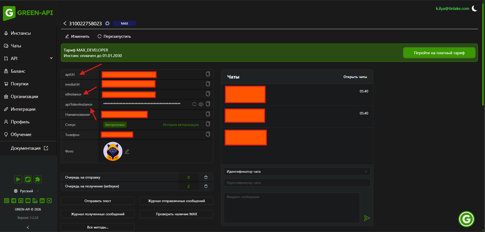
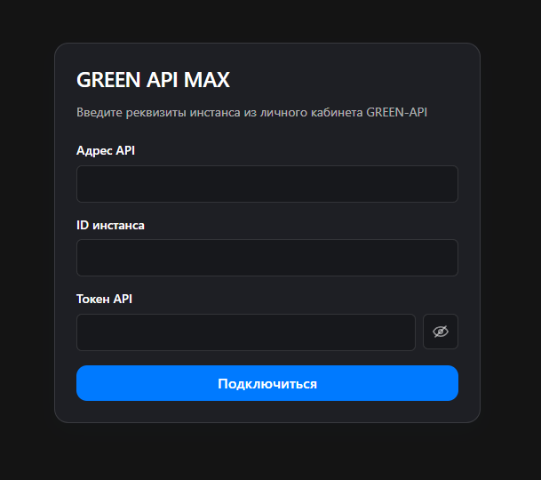
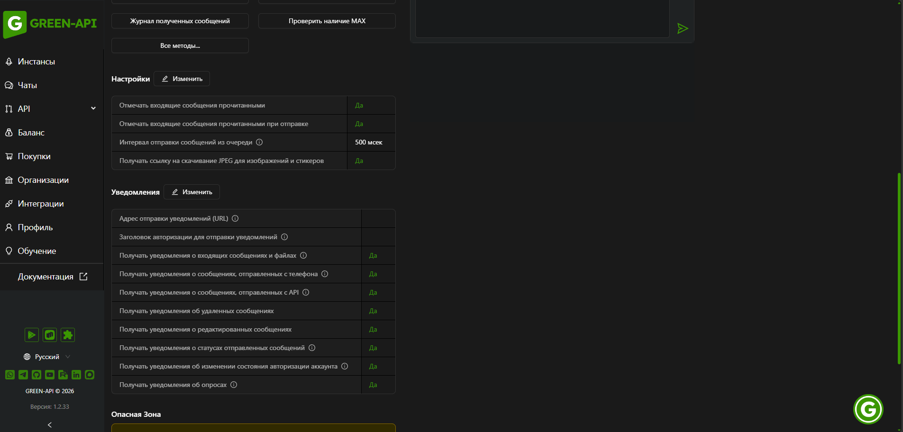

# MAX Messenger — GREEN-API

Веб-клиент личной переписки в MAX через HTTP API GREEN-API.

Ссылка на [тестовое задание](https://drive.google.com/file/d/1Ut39kkIs0QK-swnCsIPJc6pNqVIVGOD2/view)

## Демонстрация

- Опубликованное [приложение](https://green-api-wine.vercel.app/)
- Демо-видео:

https://github.com/user-attachments/assets/770bf427-d417-4ccf-90a1-1860f4a0faeb

## Основные возможности

- Подключение инстанса MAX в GREEN-API и восстановление сессии после перезагрузки страницы.
- Список личных чатов, поиск и превью последних сообщений.
- Создание чата по номеру телефона.
- История, отправка текста, ответ с цитатой, редактирование, копирование, удаление и пересылка.
- Входящие сообщения и статусы исходящих.
- Отметка прочитанного, меню сообщения и короткие уведомления об ошибках.

## Стек и архитектура

React, TypeScript, Vite, React Router, Zustand и CSS Modules. Исходный код лежит в `src` и разложен по слоям Feature-Sliced Design: `app`, `pages`, `widgets`, `features`, `entities`, `shared`. Тесты находятся в `tests`.

## Локальный запуск

Нужен Node.js 20.19 или новее в ветке 20, 22.13 или новее в ветке 22, либо 24 и новее. Так заданы требования установленных Vite и ESLint.

```bash
npm ci
npm run dev
```

Дополнительный флаг для `npm ci` не нужен.

## Подключение GREEN-API

[Официальная документация GREEN-API для MAX](https://green-api.com/v3/docs/)

1. Откройте [личный кабинет GREEN-API](https://console.green-api.com/). Если у вас ещё нет аккаунта, зарегистрируйтесь. Создайте инстанс MAX и авторизуйте его либо выберите уже авторизованный.
2. Скопируйте `apiUrl`, `idInstance` и `apiTokenInstance` из личного кабинета GREEN-API инстанса MAX и вставьте их в соответствующие поля формы входа в приложение.
3. Нажмите «Подключиться». Переписка откроется после подтверждения состояния `authorized`.



Форма входа в приложение:



### Настройка уведомлений

В настройках инстанса включите следующие уведомления:

| Настройка в кабинете GREEN-API | Значение |
| --- | --- |
| Адрес отправки уведомлений (URL) | Оставить пустым |
| Заголовок авторизации для отправки уведомлений | Оставить пустым |
| Получать уведомления о входящих сообщениях и файлах | Да |
| Получать уведомления о сообщениях, отправленных с телефона | Да |
| Получать уведомления о сообщениях, отправленных с API | Да |
| Получать уведомления об удаленных сообщениях | Да |
| Получать уведомления о редактированных сообщениях | Да |
| Получать уведомления о статусах отправленных сообщений | Да |
| Отмечать входящие сообщения прочитанными | Да |
| Отмечать входящие сообщения прочитанными при отправке | Да |

Оставьте поле **Webhook URL** пустым и сохраните изменения.
Приложение получает уведомления через `ReceiveNotification`
и удаляет обработанные из очереди через `DeleteNotification`.



## Проверки и сборка

```bash
npm run test
npm run typecheck
npm run lint
npm run lint:architecture
npm run format:check
npm run build
npm run preview
```

Результат сборки находится в `dist`.

## Ограничения

За одну загрузку берутся последние 100 сообщений чата. В списке только личные чаты. Текст, цитаты и стикеры показываются; остальные типы заменяются строкой «Этот тип сообщения не поддерживается». Редактировать свой текст можно в течение 24 часов. Успешный `SendMessage` означает постановку в очередь, а не доставку, и сам не повторяется. HTTP 466 — ограничение тарифа провайдера. Клиент не повторяет MAX целиком.
